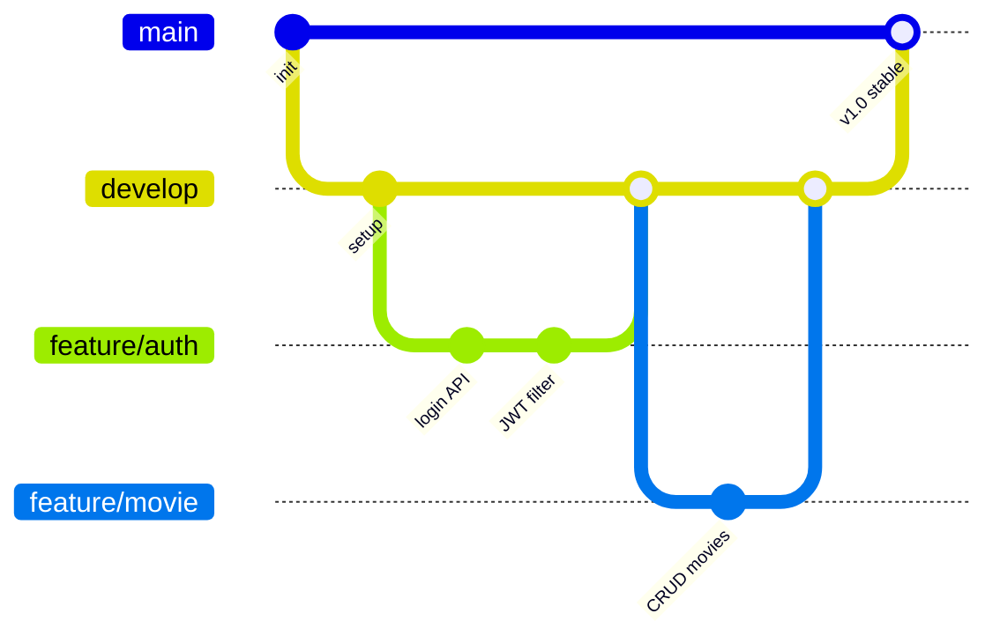

# Contributing to DevCine

Internal guide for the development team.

---

## Getting Started

### Prerequisites

- Java 21+
- Node.js 20.19+ or 22.12+
- npm 10+

### First-Time Setup

```bash
git clone https://github.com/DevCine-F/devcine.git
cd devcine
git checkout develop
```

**Backend** — create your `.env` from the template:

```bash
cd devcine-backend
cp .env.example .env
```

Fill in the credentials shared by the team lead:

```env
DB_URL=jdbc:postgresql://<host>:5432/postgres
DB_USERNAME=postgres.<project_id>
DB_PASSWORD=<password>
JWT_SECRET=<at-least-64-characters>
JWT_EXPIRATION=604800000
```

> **Do not** commit `.env` to version control.

**Frontend** — install dependencies:

```bash
cd ../devcine-frontend
npm install
```

### Running the Project

```bash
cd devcine-frontend
npm run dev:all         # backend on :8080, frontend on :5173
```

Run individually if needed:

```bash
npm run dev             # frontend only
npm run dev:backend     # backend only
```

---

## Branching Strategy

We use a simple two-branch model:



| Branch | Purpose | Merges into |
|--------|---------|-------------|
| `main` | Stable releases, demo-ready | — |
| `develop` | Latest working code | `main` when stable |
| `feature/*` | Individual work | `develop` via PR |

### Daily Workflow

```bash
# pull latest
git checkout develop
git pull origin develop

# start your work
git checkout -b feature/<name>

# commit and push
git add .
git commit -m "feat(<scope>): short description"
git push origin feature/<name>

# open a Pull Request into develop on GitHub
# at least one teammate reviews before merging
```

### When to Merge into Main

Merge `develop → main` when the team agrees the codebase is stable — typically after completing a layer or before a scheduled demo.

```bash
git checkout main
git merge develop
git push origin main
```

---

## Commit Convention

Follow [Conventional Commits](https://www.conventionalcommits.org/):

```
feat(auth):       add JWT refresh endpoint
fix(booking):     prevent double seat reservation
docs(database):   document lost_and_found table
refactor(wallet): extract price calculation
chore(deps):      bump spring-boot to 4.0.6
```

---

## What to Read Before Writing Code

| Situation | Read |
|-----------|------|
| Every session | `RULES.md` |
| Touching backend logic | `docs/CRITICAL_PATHS.md` |
| Changing database schema | `docs/DATABASE.md` |
| Adding or modifying an API | `docs/API_CONTRACTS.md` |

---

## Module Dependency Order

Development follows a layered approach. A layer cannot start until its dependencies are complete.

| Layer | Modules | Depends on |
|-------|---------|------------|
| 1 | Auth, Security, Global Exception Handler | — |
| 2 | Users, Customers, Staffs, Cinemas, Rooms, Seats | 1 |
| 3 | Movies, Categories, Formats, Seat Types | 1 |
| 4 | Showtimes, Pricing Rules, Shifts, Schedules | 2, 3 |
| 5 | **Bookings, Wallets, Tickets** | 2, 3, 4 |
| 6 | F&B Items, Inventory | 2 |
| 7 | Promotions, Vouchers, Reviews | 5 |
| 8 | Shift Handovers, Support Tickets, Lost & Found | 2 |
| 9 | Banners, Audit Logs | 1 |

---

## Troubleshooting

| Problem | Fix |
|---------|-----|
| `Driver claims to not accept jdbcUrl` | `.env` is missing or `DB_URL` is wrong |
| Port 8080 already in use | `netstat -ano \| findstr :8080` then `taskkill /PID <pid> /F` |
| Frontend module resolution errors | Delete `node_modules` and run `npm install` again |
| Merge conflicts on develop | Coordinate with the last person who merged; resolve together |
