# DevCine — ERD Ver8 (đồng bộ với code, 2026-06-30)

> Sơ đồ này phản ánh **đúng 40 entity hiện có** trong
> `devcine-backend/src/main/java/com/devcine/backend/entity/`.
> Khác ERD_Ver7: đã gỡ `wallets`/`wallet_transactions`, thêm 9 bảng mới + bảng nối
> `movie_genre_mapping`, và cập nhật cột cho `bookings`, `movies`, `promotions`…
> Xem chi tiết khác biệt ở [`erd-diff.md`](erd-diff.md).
>
> Render: GitHub/VS Code (Mermaid) hiển thị trực tiếp. Có thể tách thành nhiều
> sơ đồ con nếu file render chậm.

```mermaid
erDiagram
    %% ===================== NGƯỜI DÙNG & PHÂN QUYỀN =====================
    ROLES {
        int id PK
        string name
        text permissions_matrix
    }
    USERS {
        int id PK
        string username UK
        string password_hash
        string full_name
        string avatar_url
        string email UK
        string phone
        int role_id FK
        boolean is_active
        datetime created_at
    }
    CUSTOMERS {
        int user_id PK "FK->users (@MapsId)"
        date dob
        string id_card
        string membership_tier
        int loyalty_points
    }
    STAFFS {
        int user_id PK "FK->users (@MapsId)"
        string staff_code UK
        int cinema_id FK
        int manager_id FK
    }
    AUDIT_LOGS {
        int id PK
        int user_id FK
        string action
        string target_table
        string ip_address
        datetime timestamp
    }
    NOTIFICATIONS {
        int id PK
        int customer_id FK
        string title
        text message
        string type
        boolean is_read
        datetime created_at
    }
    SUPPORT_TICKETS {
        int id PK
        int customer_id FK
        int assigned_to_staff FK
        string issue_type
        text description
        string status
        datetime created_at
    }

    %% ===================== RẠP - PHÒNG - GHẾ =====================
    CINEMAS {
        int id PK
        string name
        string address
        string city
        string district
        string type
        string hotline
        int rooms
        string image_url
        text description
        double latitude
        double longitude
        text amenities
        string status
        int manager_id FK
    }
    ROOMS {
        int id PK
        int cinema_id FK
        string name
        string type
        string status
        int turnaround_time_mins
        int matrix_row
        int matrix_col
    }
    SEATS {
        int id PK
        int room_id FK
        string row_char
        int col_num
        int seat_type_id FK
        boolean is_active
        int grid_row
        int grid_col
    }
    SEAT_TYPES {
        int id PK
        string name UK
        string color_code
        decimal price_modifier
    }

    %% ===================== PHIM - SUẤT - ĐỊNH DẠNG =====================
    MOVIES {
        int id PK
        string title
        string slug UK
        int duration_mins
        string age_rating
        date release_date
        date end_date
        string status
        string country
        string rating
        text poster_base64
        text banner_base64
        boolean show_on_banner
        string trailer_url
        string format
        string supported_formats
        string title_vietnamese
        int production_year
        string language
        double base_price
        text description
        string original_language
        string version_type
        text internal_notes
        date start_date
        string distributor
        string director
        text cast_members
        int rating_count
    }
    MOVIE_FORMATS {
        int id PK
        string name UK
        string description
        decimal surcharge
        decimal weekend_surcharge
        boolean is_fixed_price
    }
    CATEGORIES {
        int id PK
        string name UK
        string description
    }
    MOVIE_CATEGORIES {
        int movie_id PK "FK"
        int category_id PK "FK"
    }
    MOVIE_GENRE_MAPPING {
        int movie_id FK
        int category_id FK
    }
    AGE_RATINGS {
        int id PK
        string code UK
        string name
        string description
    }
    SHOWTIMES {
        int id PK
        int movie_id FK
        int room_id FK
        int format_id FK
        datetime start_time
        datetime end_time
        string status
    }
    REVIEWS {
        int id PK
        int customer_id FK
        int movie_id FK
        int ticket_id FK
        int rating
        text comment
        boolean hidden
        datetime created_at
    }

    %% ===================== ĐẶT VÉ =====================
    BOOKINGS {
        int id PK
        int customer_id FK
        int showtime_id FK
        int voucher_id FK
        decimal total_price
        decimal final_price
        string payment_method
        string status
        string booking_code UK
        datetime created_at
        datetime printed_at
        int printed_by FK
    }
    BOOKING_SEATS {
        int id PK
        int booking_id FK
        int seat_id FK
        decimal price_snapshot
        string ticket_type
        string status
    }
    BOOKING_FNBS {
        int id PK
        int booking_id FK
        int fnb_item_id FK
        int quantity
        decimal price_snapshot
    }
    TICKETS {
        int id PK
        int booking_seat_id FK "UK OneToOne"
        string qr_code
        boolean is_checked_in
        boolean is_age_verified
        int checked_in_by FK
        datetime check_in_time
    }

    %% ===================== KHUYẾN MÃI =====================
    PROMOTIONS {
        int id PK
        string code UK
        string name
        string description
        string discount_type
        decimal discount_value
        datetime start_date
        datetime end_date
        boolean is_stackable
        int points_required
        boolean allow_point_redemption
        decimal min_order_value
        int applicable_movie_id
        string customer_eligibility
        int usage_limit
        int used_count
    }
    VOUCHERS {
        int id PK
        int customer_id FK
        int promotion_id FK
        datetime valid_until
        boolean is_used
    }
    PROMO_ARTICLES {
        int id PK
        string title
        string description
        string image_url
        text content
        date start_date
        date end_date
        boolean is_active
        int display_order
        datetime created_at
    }
    BANNERS {
        int id PK
        string title
        string image_url
        string mode
        int movie_id
        string placement
        datetime start_date
        datetime end_date
        boolean is_active
        int display_order
        string link
    }

    %% ===================== BẮP NƯỚC (F&B) - KHO =====================
    FNB_ITEMS {
        int id PK
        string name
        string type
        decimal price
        string image_url
        string description
        boolean is_active
    }
    CONCESSION_SALES {
        int id PK
        string sale_code UK
        int customer_id FK
        decimal total_price
        string payment_method
        string status
        datetime created_at
    }
    CONCESSION_SALE_ITEMS {
        int id PK
        int sale_id FK
        int fnb_item_id FK
        int quantity
        decimal price_snapshot
    }

    %% ===================== CA LÀM - BÀN GIAO =====================
    SHIFTS {
        int id PK
        datetime start_time
        datetime end_time
        string status
    }
    STAFF_SCHEDULES {
        int id PK
        int staff_id FK
        int shift_id FK
        date work_date
        string status
    }
    SHIFT_HANDOVERS {
        int id PK
        int staff_schedule_id FK
        int approved_by_manager FK
        decimal declared_cash
        decimal system_cash
        decimal difference
        string status
    }

    %% ===================== GIÁ - CẤU HÌNH - DANH MỤC ĐỘC LẬP =====================
    PRICING_RULES {
        int id PK
        string name
        string rule_type
        string day_type
        string time_slot
        string audience_type
        decimal value
        int priority
        boolean active
        datetime start_date
        datetime end_date
    }
    SPECIAL_SEAT_PRICES {
        int id PK
        int format_id FK
        int seat_type_id FK
        decimal price
    }
    HOLIDAYS {
        int id PK
        date holiday_date UK
        string name
    }
    FAQS {
        int id PK
        string category
        string question
        text answer
        int display_order
        boolean is_active
    }
    SYSTEM_SETTINGS {
        string setting_key PK
        text setting_value
    }

    %% ===================== QUAN HỆ =====================
    ROLES         ||--o{ USERS            : "has"
    USERS         ||--o| CUSTOMERS        : "is-a"
    USERS         ||--o| STAFFS           : "is-a"
    USERS         ||--o{ AUDIT_LOGS       : "logs"
    CUSTOMERS     ||--o{ NOTIFICATIONS    : "receives"
    CUSTOMERS     ||--o{ SUPPORT_TICKETS  : "opens"
    STAFFS        ||--o{ SUPPORT_TICKETS  : "assigned"
    STAFFS        ||--o{ STAFFS           : "manages"
    STAFFS        ||--o| CINEMAS          : "manages"
    CINEMAS       ||--o{ STAFFS           : "employs"
    CINEMAS       ||--o{ ROOMS            : "has"
    ROOMS         ||--o{ SEATS            : "contains"
    SEAT_TYPES    ||--o{ SEATS            : "types"
    MOVIES        ||--o{ SHOWTIMES        : "scheduled"
    ROOMS         ||--o{ SHOWTIMES        : "hosts"
    MOVIE_FORMATS ||--o{ SHOWTIMES        : "format"
    MOVIES        ||--o{ MOVIE_CATEGORIES : "tagged"
    CATEGORIES    ||--o{ MOVIE_CATEGORIES : "tagged"
    MOVIES        ||--o{ MOVIE_GENRE_MAPPING : "genres"
    CATEGORIES    ||--o{ MOVIE_GENRE_MAPPING : "genres"
    CUSTOMERS     ||--o{ BOOKINGS         : "books"
    SHOWTIMES     ||--o{ BOOKINGS         : "for"
    VOUCHERS      ||--o{ BOOKINGS         : "applied"
    STAFFS        ||--o{ BOOKINGS         : "prints"
    BOOKINGS      ||--o{ BOOKING_SEATS    : "has"
    SEATS         ||--o{ BOOKING_SEATS    : "booked"
    BOOKINGS      ||--o{ BOOKING_FNBS     : "addons"
    FNB_ITEMS     ||--o{ BOOKING_FNBS     : "ordered"
    BOOKING_SEATS ||--o| TICKETS          : "issues"
    STAFFS        ||--o{ TICKETS          : "checks-in"
    CUSTOMERS     ||--o{ REVIEWS          : "writes"
    MOVIES        ||--o{ REVIEWS          : "reviewed"
    TICKETS       ||--o{ REVIEWS          : "verifies"
    PROMOTIONS    ||--o{ VOUCHERS         : "issues"
    CUSTOMERS     ||--o{ VOUCHERS         : "owns"
    CUSTOMERS     ||--o{ CONCESSION_SALES : "buys"
    CONCESSION_SALES ||--o{ CONCESSION_SALE_ITEMS : "has"
    FNB_ITEMS     ||--o{ CONCESSION_SALE_ITEMS : "sold"
    SHIFTS        ||--o{ STAFF_SCHEDULES  : "scheduled"
    STAFFS        ||--o{ STAFF_SCHEDULES  : "works"
    STAFF_SCHEDULES ||--o{ SHIFT_HANDOVERS : "handover"
    STAFFS        ||--o{ SHIFT_HANDOVERS  : "approves"
    MOVIE_FORMATS ||--o{ SPECIAL_SEAT_PRICES : "fixed-price"
    SEAT_TYPES    ||--o{ SPECIAL_SEAT_PRICES : "fixed-price"
```

## Ghi chú quan hệ chưa biểu diễn bằng FK trong code

- `MOVIES.age_rating` (string) **chưa** có FK tới `AGE_RATINGS` — bảng `age_ratings` hiện chỉ là danh mục độc lập.
- `BANNERS.movie_id`, `PROMOTIONS.applicable_movie_id` là cột Integer thô (không khai báo `@ManyToOne`) → quan hệ "mềm", không có ràng buộc khóa ngoại.
- `MOVIE_GENRE_MAPPING` và `MOVIE_CATEGORIES` **trùng vai trò** — nên hợp nhất về một cơ chế.
- `HOLIDAYS`, `FAQS`, `SYSTEM_SETTINGS`, `PROMO_ARTICLES`, `PRICING_RULES` là bảng độc lập (không FK ra ngoài).
