# DevCine — ERD Ver9 (đồng bộ với code, 2026-08-16)

> Sơ đồ phản ánh **đúng 43 entity** hiện có trong
> `devcine-backend/src/main/java/com/devcine/backend/entity/`, cộng bảng nối
> `movie_genre_mapping` (sinh từ `@ManyToMany` của `Movie.genres`) → **44 bảng**.
>
> **Khác ERD Ver8** — xem chi tiết ở [`erd-diff-v8-v9.md`](erd-diff-v8-v9.md):
> - Gỡ 4 bảng: `shifts`, `staff_schedules`, `shift_handovers`, `special_seat_prices`
> - Thêm 10 bảng: `fnb_option_groups`, `fnb_option_items`, `fnb_item_slots`,
>   `booking_fnb_options`, `concession_sale_item_options`, `seat_incidents`,
>   `point_transactions`, `user_permission_overrides`, `approval_requests`, `promo_email_log`
> - Sửa cột ở 16 bảng (thêm `sold_by`, `seat_status`, `room_type`, `layout_data`…;
>   bỏ `price_modifier`, `base_price`, `is_fixed_price`)
>
> Bản vẽ trực quan (drawio, cùng bảng màu với `ERD_View.drawio.xml`):
> [`ERD_Ver9.drawio.xml`](ERD_Ver9.drawio.xml) · Từ điển dữ liệu: [`ERD_Ver9_MoTa.md`](ERD_Ver9_MoTa.md)
>
> Render: GitHub / VS Code (Mermaid) hiển thị trực tiếp.

```mermaid
erDiagram
    %% ===================== NGƯỜI DÙNG & PHÂN QUYỀN =====================
    ROLES {
        int id PK
        string name UK
        text permissions_matrix
    }
    USERS {
        int id PK
        string username UK
        string password_hash
        string full_name
        string avatar_url
        string email UK
        string phone
        int role_id FK
        boolean is_active
        boolean must_change_password
        datetime created_at
    }
    CUSTOMERS {
        int user_id PK
        date dob
        string id_card
        string membership_tier
        int loyalty_points
        int lifetime_points
    }
    STAFFS {
        int user_id PK
        string staff_code UK
        int cinema_id FK
        int manager_id FK
        datetime created_at
        datetime updated_at
    }
    USER_PERMISSION_OVERRIDES {
        int id PK
        int user_id FK
        string feature UK
        string action UK
        string effect
        datetime updated_at
    }
    AUDIT_LOGS {
        int id PK
        int user_id FK
        string action
        string target_table
        string ip_address
        datetime timestamp
    }
    NOTIFICATIONS {
        int id PK
        int customer_id FK
        string title
        text message
        string type
        boolean is_read
        datetime created_at
    }
    SUPPORT_TICKETS {
        int id PK
        int customer_id FK
        int assigned_to_staff FK
        string issue_type
        text description
        string phone
        string status
        text admin_reply
        datetime replied_at
        datetime created_at
    }
    POINT_TRANSACTIONS {
        int id PK
        int customer_id FK
        int points
        string type
        string source
        string ref_code
        int balance_after
        text note
        datetime created_at
    }
    %% ===================== RẠP - PHÒNG - GHẾ =====================
    CINEMAS {
        int id PK
        string name
        string address
        string city
        string district
        string type
        string hotline
        int rooms
        string image_url
        text description
        double latitude
        double longitude
        text amenities
        string status
        time opening_time
        time closing_time
        int manager_id FK
    }
    ROOMS {
        int id PK
        int cinema_id FK
        string name UK
        string type
        string status
        int turnaround_time_mins
        int matrix_row
        int matrix_col
    }
    SEATS {
        int id PK
        int room_id FK
        string row_char
        int col_num
        int seat_type_id FK
        boolean is_active
        string label
        boolean custom_label
        string seat_status
        int grid_row
        int grid_col
        string cell_kind
    }
    SEAT_TYPES {
        int id PK
        string name UK
        string color_code
    }
    %% ===================== PHIM & PHÂN LOẠI =====================
    MOVIES {
        int id PK
        string title
        string slug UK
        int duration_mins
        string age_rating
        date release_date
        date start_date
        date end_date
        string status
        string country
        string rating
        int rating_count
        text poster_base64
        text banner_base64
        boolean show_on_banner
        string trailer_url
        string format
        string supported_formats
        string title_vietnamese
        int production_year
        string language
        string original_language
        string version_type
        string distributor
        string director
        text cast_members
        text description
        text internal_notes
    }
    CATEGORIES {
        int id PK
        string name UK
        string description
    }
    MOVIE_GENRE_MAPPING {
        int movie_id FK
        int category_id FK
    }
    MOVIE_CATEGORIES {
        int movie_id PK
        int category_id PK
    }
    MOVIE_FORMATS {
        int id PK
        string name UK
        string description
        decimal surcharge
        decimal weekend_surcharge
    }
    AGE_RATINGS {
        int id PK
        string code UK
        string name
        string description
    }
    %% ===================== SUẤT CHIẾU - ĐẶT VÉ - VÉ =====================
    SHOWTIMES {
        int id PK
        int movie_id FK
        int room_id FK
        int format_id FK
        datetime start_time
        datetime end_time
        string status
        text layout_data
    }
    BOOKINGS {
        int id PK
        int customer_id FK
        int showtime_id FK
        int voucher_id FK
        int sold_by FK
        int printed_by FK
        decimal total_price
        decimal final_price
        string payment_method
        string payment_gateway_ref
        string status
        string booking_code UK
        string channel
        string pos_terminal_id
        datetime created_at
        datetime printed_at
        datetime expires_at
    }
    BOOKING_SEATS {
        int id PK
        int booking_id FK
        int seat_id FK
        decimal price_snapshot
        string ticket_type
        string status
    }
    TICKETS {
        int id PK
        int booking_seat_id UK
        string qr_code
        boolean is_checked_in
        boolean is_age_verified
        int checked_in_by FK
        datetime check_in_time
    }
    REVIEWS {
        int id PK
        int customer_id FK
        int movie_id FK
        int ticket_id FK
        int rating
        text comment
        boolean hidden
        datetime created_at
    }
    SEAT_INCIDENTS {
        int id PK
        string incident_type
        int booking_id FK
        int showtime_id FK
        int old_seat_id FK
        int new_seat_id FK
        string old_seat_label
        string new_seat_label
        string compensation_type
        decimal compensation_amount
        int voucher_id FK
        string reason
        int handled_by FK
        int cinema_id FK
        datetime created_at
    }
    %% ===================== BẮP NƯỚC (F&B) =====================
    FNB_ITEMS {
        int id PK
        string name
        string type
        decimal price
        string image_url
        string description
        boolean is_active
        boolean is_deleted
    }
    FNB_OPTION_GROUPS {
        int id PK
        string name UK
    }
    FNB_OPTION_ITEMS {
        int id PK
        int group_id FK
        string name UK
        decimal surcharge_price
    }
    FNB_ITEM_SLOTS {
        int id PK
        int fnb_item_id FK
        int option_group_id FK
        int default_option_item_id FK
        string slot_label
        int display_order
        int min_choices
        int max_choices
        boolean is_required
    }
    BOOKING_FNBS {
        int id PK
        int booking_id FK
        int fnb_item_id FK
        string item_name_snapshot
        int quantity
        decimal price_snapshot
    }
    BOOKING_FNB_OPTIONS {
        int id PK
        int booking_fnb_id FK
        int option_group_id FK
        int option_item_id FK
        string slot_label_snapshot
        string option_name_snapshot
        decimal surcharge_snapshot
    }
    CONCESSION_SALES {
        int id PK
        string sale_code UK
        int customer_id FK
        int sold_by FK
        int cinema_id FK
        decimal total_price
        string payment_method
        string status
        datetime created_at
    }
    CONCESSION_SALE_ITEMS {
        int id PK
        int sale_id FK
        int fnb_item_id FK
        string item_name_snapshot
        int quantity
        decimal price_snapshot
    }
    CONCESSION_SALE_ITEM_OPTIONS {
        int id PK
        int sale_item_id FK
        int option_group_id FK
        int option_item_id FK
        string slot_label_snapshot
        string option_name_snapshot
        decimal surcharge_snapshot
    }
    %% ===================== KHUYẾN MÃI & NỘI DUNG =====================
    PROMOTIONS {
        int id PK
        string code UK
        string name
        string description
        string discount_type
        decimal discount_value
        datetime start_date
        datetime end_date
        boolean is_stackable
        int points_required
        boolean allow_point_redemption
        decimal min_order_value
        int applicable_movie_id
        string customer_eligibility
        int usage_limit
        int used_count
        int max_ticket_quantity
        decimal max_discount_amount
        datetime campaign_sent_at
        int campaign_sent_count
    }
    VOUCHERS {
        int id PK
        int customer_id FK
        int promotion_id FK
        datetime valid_until
        boolean is_used
        datetime used_at
    }
    PROMO_EMAIL_LOG {
        int id PK
        int promotion_id UK
        int customer_id UK
        datetime sent_at
    }
    PROMO_ARTICLES {
        int id PK
        string title
        string description
        string image_url
        text content
        date start_date
        date end_date
        boolean is_active
        int display_order
        datetime created_at
    }
    BANNERS {
        int id PK
        string title
        string image_url
        string mode
        int movie_id
        string placement
        datetime start_date
        datetime end_date
        boolean is_active
        int display_order
        string link
    }
    %% ===================== CẤU HÌNH & DANH MỤC =====================
    PRICING_RULES {
        int id PK
        string name
        string rule_type
        string day_type
        string room_type
        string time_slot
        string audience_type
        decimal value
        int priority
        boolean active
        datetime start_date
        datetime end_date
    }
    HOLIDAYS {
        int id PK
        date holiday_date UK
        string name
    }
    FAQS {
        int id PK
        string category
        string question
        text answer
        int display_order
        boolean is_active
    }
    SYSTEM_SETTINGS {
        string setting_key PK
        text setting_value
    }
    APPROVAL_REQUESTS {
        int id PK
        string type
        int ref_id
        string ref_code
        text payload
        string summary
        text reason
        string status
        int cinema_id
        int requested_by_user_id
        string requested_by_name
        int approved_by_user_id
        string approved_by_name
        text decision_note
        datetime created_at
        datetime decided_at
    }
    %% ===================== QUAN HỆ =====================
    %% --- Người dùng & phân quyền ---
    ROLES         ||--o{ USERS                     : "has"
    USERS         ||--o| CUSTOMERS                 : "is-a (MapsId)"
    USERS         ||--o| STAFFS                    : "is-a (MapsId)"
    USERS         ||--o{ AUDIT_LOGS                : "logs"
    USERS         ||--o{ USER_PERMISSION_OVERRIDES : "overrides"
    CUSTOMERS     ||--o{ NOTIFICATIONS             : "receives"
    CUSTOMERS     ||--o{ SUPPORT_TICKETS           : "opens"
    STAFFS        ||--o{ SUPPORT_TICKETS           : "assigned"
    CUSTOMERS     ||--o{ POINT_TRANSACTIONS        : "earns-spends"
    STAFFS        ||--o{ STAFFS                    : "manages"

    %% --- Rạp - Phòng - Ghế ---
    STAFFS        ||--o{ CINEMAS                   : "manager-of"
    CINEMAS       ||--o{ STAFFS                    : "employs"
    CINEMAS       ||--o{ ROOMS                     : "has"
    ROOMS         ||--o{ SEATS                     : "contains"
    SEAT_TYPES    ||--o{ SEATS                     : "types"

    %% --- Phim & phân loại ---
    MOVIES        ||--o{ MOVIE_GENRE_MAPPING       : "genres"
    CATEGORIES    ||--o{ MOVIE_GENRE_MAPPING       : "genres"
    MOVIES        ||--o{ MOVIE_CATEGORIES          : "tagged-legacy"
    CATEGORIES    ||--o{ MOVIE_CATEGORIES          : "tagged-legacy"

    %% --- Suất chiếu - Đặt vé - Vé ---
    MOVIES        ||--o{ SHOWTIMES                 : "scheduled"
    ROOMS         ||--o{ SHOWTIMES                 : "hosts"
    MOVIE_FORMATS ||--o{ SHOWTIMES                 : "format"
    CUSTOMERS     ||--o{ BOOKINGS                  : "books"
    SHOWTIMES     ||--o{ BOOKINGS                  : "for"
    VOUCHERS      ||--o{ BOOKINGS                  : "applied"
    STAFFS        ||--o{ BOOKINGS                  : "sold-by-printed-by"
    BOOKINGS      ||--o{ BOOKING_SEATS             : "has"
    SEATS         ||--o{ BOOKING_SEATS             : "booked"
    BOOKING_SEATS ||--o| TICKETS                   : "issues"
    STAFFS        ||--o{ TICKETS                   : "checks-in"
    CUSTOMERS     ||--o{ REVIEWS                   : "writes"
    MOVIES        ||--o{ REVIEWS                   : "reviewed"
    TICKETS       ||--o{ REVIEWS                   : "verifies"

    %% --- Xử lý sự cố / đổi ghế đền bù ---
    BOOKINGS      ||--o{ SEAT_INCIDENTS            : "incident"
    SHOWTIMES     ||--o{ SEAT_INCIDENTS            : "at"
    SEATS         ||--o{ SEAT_INCIDENTS            : "old-seat-new-seat"
    VOUCHERS      ||--o{ SEAT_INCIDENTS            : "compensates"
    STAFFS        ||--o{ SEAT_INCIDENTS            : "handled-by"
    CINEMAS       ||--o{ SEAT_INCIDENTS            : "scope"

    %% --- Bắp nước (Option Pool + Combo Slot) ---
    FNB_OPTION_GROUPS ||--o{ FNB_OPTION_ITEMS                 : "contains"
    FNB_ITEMS         ||--o{ FNB_ITEM_SLOTS                   : "combo-slots"
    FNB_OPTION_GROUPS ||--o{ FNB_ITEM_SLOTS                   : "pool"
    FNB_OPTION_ITEMS  ||--o{ FNB_ITEM_SLOTS                   : "default"
    BOOKINGS          ||--o{ BOOKING_FNBS                     : "addons"
    FNB_ITEMS         ||--o{ BOOKING_FNBS                     : "ordered"
    BOOKING_FNBS      ||--o{ BOOKING_FNB_OPTIONS              : "options"
    FNB_OPTION_GROUPS ||--o{ BOOKING_FNB_OPTIONS              : "group-snapshot"
    FNB_OPTION_ITEMS  ||--o{ BOOKING_FNB_OPTIONS              : "item-snapshot"
    CUSTOMERS         ||--o{ CONCESSION_SALES                 : "buys"
    STAFFS            ||--o{ CONCESSION_SALES                 : "sold-by"
    CINEMAS           ||--o{ CONCESSION_SALES                 : "at"
    CONCESSION_SALES  ||--o{ CONCESSION_SALE_ITEMS            : "has"
    FNB_ITEMS         ||--o{ CONCESSION_SALE_ITEMS            : "sold"
    CONCESSION_SALE_ITEMS ||--o{ CONCESSION_SALE_ITEM_OPTIONS : "options"
    FNB_OPTION_GROUPS ||--o{ CONCESSION_SALE_ITEM_OPTIONS     : "group-snapshot"
    FNB_OPTION_ITEMS  ||--o{ CONCESSION_SALE_ITEM_OPTIONS     : "item-snapshot"

    %% --- Khuyến mãi ---
    PROMOTIONS    ||--o{ VOUCHERS                  : "issues"
    CUSTOMERS     ||--o{ VOUCHERS                  : "owns"

    %% --- Quan hệ MỀM (cột số thô, KHÔNG khai báo FK trong entity) ---
    AGE_RATINGS   ||..o{ MOVIES                    : "soft-age-rating"
    MOVIES        ||..o{ BANNERS                   : "soft-movie-id"
    MOVIES        ||..o{ PROMOTIONS                : "soft-applicable-movie"
    PROMOTIONS    ||..o{ PROMO_EMAIL_LOG           : "soft-promotion-id"
    CUSTOMERS     ||..o{ PROMO_EMAIL_LOG           : "soft-customer-id"
```

## Ghi chú quan trọng

### 1. Quan hệ "mềm" — không có ràng buộc khóa ngoại

Các cột dưới đây mang ý nghĩa tham chiếu nhưng chỉ khai báo là `Integer`/`String` thô
trong entity (nét đứt `||..o{` ở sơ đồ trên, nét đứt ở bản drawio):

| Bảng | Cột | Trỏ tới |
|---|---|---|
| `movies` | `age_rating` (string) | `age_ratings.code` |
| `banners` | `movie_id` | `movies.id` |
| `promotions` | `applicable_movie_id` | `movies.id` |
| `promo_email_log` | `promotion_id`, `customer_id` | `promotions.id`, `customers.user_id` |
| `approval_requests` | `cinema_id`, `ref_id`, `requested_by_user_id`, `approved_by_user_id` | `cinemas`, tuỳ `type`, `users` |

### 2. `movie_categories` vs `movie_genre_mapping`

Cả hai cùng nối phim ↔ thể loại. Cơ chế **đang thực sự được code dùng** là
`movie_genre_mapping` (sinh từ `@ManyToMany` trên `Movie.genres`); `movie_categories`
(entity `MovieCategory` với `@IdClass`) là di sản còn sót lại, nên hợp nhất về một cơ chế.

### 3. Những gì KHÔNG nằm trong ERD

- **Giữ ghế tạm thời** (chống đặt trùng POS + online) không lưu DB — xử lý real-time
  qua WebSocket/STOMP, state in-memory.
- **Kho / định mức BOM** đã gỡ hoàn toàn (11/07/2026): tồn kho vô hạn, không còn
  `bom_recipes` / `inventory_logs` / `cinema_inventory`.
- **Ca làm việc & bàn giao ca** đã gỡ hoàn toàn (01/08/2026): phân quyền nay chạy
  RBAC thuần + Strict Cinema Scoping (`staffs.cinema_id` trong JWT); dấu vết người bán
  ghi qua `bookings.sold_by` / `concession_sales.sold_by`.
- **Ví điện tử** (`wallets`, `wallet_transactions`) đã gỡ từ Ver8.

### 4. Mô hình giá — Flat Pricing V4

Không còn `seat_types.price_modifier`, `movies.base_price`, `movie_formats.is_fixed_price`
và bảng `special_seat_prices`. Giá vé nay **phẳng theo ma trận** `pricing_rules.room_type`
(STANDARD / SUPERPLEX / CINE_COMFORT) × `day_type` × `time_slot` × `audience_type`,
cộng phụ thu định dạng ở `movie_formats.surcharge` / `weekend_surcharge`.

### 5. Ràng buộc duy nhất (UK) nhiều cột

| Bảng | UK |
|---|---|
| `rooms` | (`cinema_id`, `name`) |
| `fnb_option_items` | (`group_id`, `name`) |
| `user_permission_overrides` | (`user_id`, `feature`, `action`) |
| `promo_email_log` | (`promotion_id`, `customer_id`) |
| `movie_categories` | PK kép (`movie_id`, `category_id`) |
